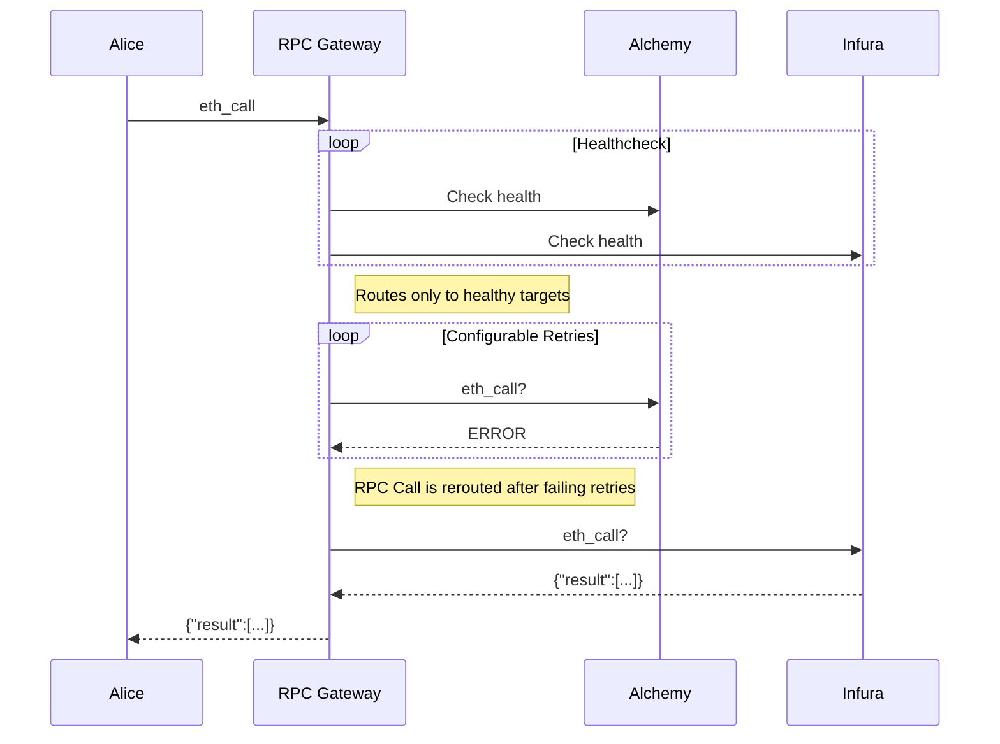

RPC Gateway
===

RPC Gateway acts as a failover proxy routing ETH RPC requests across configured RPC nodes. For every ETH RPC node(group) configured the RPC Gateway tracks its latency, current height and error rates. These are then used to determine whether or not to failover.

From a high level it simply looks like this:


The gateway assesses the health of the underlying RPC provider by:
- continuously (configurable how often) checking the blockNumber, if the request fails or timeouts it marks it as unhealthy (configurable thresholds)
- every request that fails will be rerouted to the next available healthy target after a configurable amount of retries
  - if it will be rerouted the current target will be "tainted"

## Developing

Start dependent services
```zsh
docker-compose up
```

Make sure the test pass
```zsh
go test
```

To run the app locally
```zsh
go run . --config ./example_config.yml
```

## Running & Configuration

Build the binary:
```
go build
```

The statically linked `rpc-gateway` binary has one flag `--config` that defaults to `./config.yml` simply run it by:
```
./rpc-gateway --config ~/.rpc-gateway/config.yml
```


### Configuration

```yaml
metrics:
  port: "9090" # port for prometheus metrics, served on /metrics and /

proxy:
  port: "3000" # port for RPC gateway
  upstreamTimeout: "1s" # when is a request considered timed out
  
  # The number of retries within the same RPC target for a single request
  allowedNumberOfRetriesPerTarget: 2
  retryDelay: "10ms" # delay between retries

  # The total number of failovers (switching to the next healthy RPC target)
  allowedNumberOfFailovers: 1

  # Note: the maximum number of retries for a request = (1 + allowedNumberOfFailovers) * allowedNumberOfRetriesPerTarget

healthChecks:
  interval: "5s" # how often to do healthchecks
  timeout: "1s" # when should the timeout occur and considered unhealthy
  failureThreshold: 2 # how many failed checks until marked as unhealthy
  successThreshold: 1 # how many successes to be marked as healthy again

targets: # the order here determines the failover order
  - name: "Cloudflare"
    connection:
      http: # ws is supported by default, it will be a sticky connection.
        url: "https://cloudflare-eth.com"
  - name: "Alchemy"
    connection:
      http: # ws is supported by default, it will be a sticky connection.
        url: "https://alchemy.com/rpc/<apikey>"
```

## Websockets

Websockets are sticky and are handled transparently.

## Taints

Taints are a way for the `HealthcheckManager` to mark a node as unhealthy even though it responds to RPC calls. Some reasons for that are:
- BlockNumber is way behind a "quorum".
- A number of proxied requests fail in a given time.

Currently taint clearing is not implemented yet.

## TODOs

- [ ] Add geth_override eth_call to healthchecks ( this one [here](./contracts/GasLeft.sol "here") )
- [ ] Encapsulate into `middleware` `healthchecker` packages.
- [ ] Add Blockchain aware caching.
- [ ] Handle taints better?
- [ ] BlockNumber divergence automatic handling.
- [ ] Expand configuration options by exposing all reverseproxy settings
- [ ] Add defaults to YAML config.
- [ ] Pass logger around instead of using a global one.
